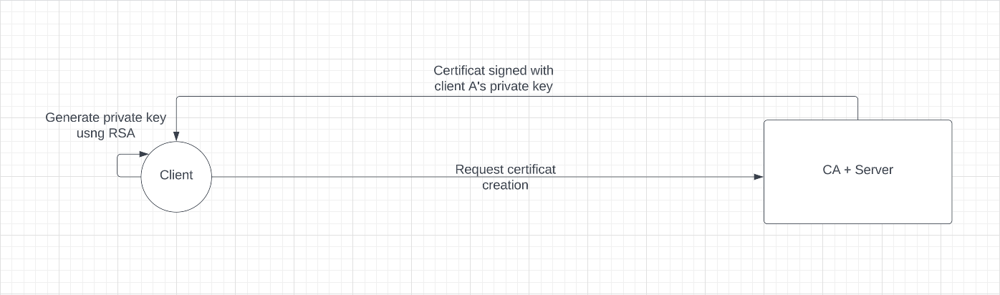
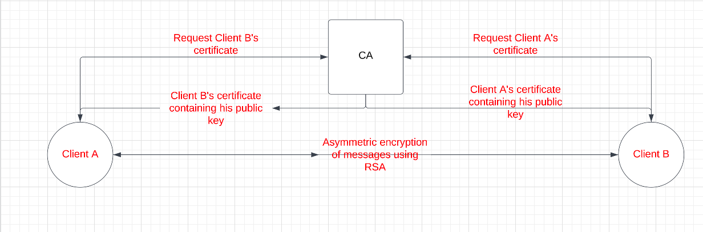

<div align="center">
<h1 style="color:#FEBB59">E2E Chatroom</h1>
  <p align="center">
    E2E chatroom based on certificats and encryption.
    <br />
  </p>
</div>
<details>
  <summary>Table of Contents</summary>
  <ol>
    <li><a href="#contributors">Contributors</a></li>
    <li>
      <a href="#about-the-project">About The Project</a>
    </li>
    <li><a href="#usage">Usage</a></li>
    <li><a href="#demo">Demo</a></li>
  </ol>
</details>

## Contributors
This project was made possible through the efforts of :
* Ala Ben Hamouda
* Azer Chabbar
* Taoufik Kaabi
## About The Project 
1. The first phase of establishing the chatroom is the creation of the certificate authority (<a href="https://arminreiter.com/2022/01/create-your-own-certificate-authority-ca-using-openssl/">read more</a>):
* Step 1: Create a private key for the CA.
```shell
 openssl genrsa -aes256 -out ca.key 4096
```
* Step 2: Create Certificate of the CA
```shell
 openssl req -x509 -new -nodes -key ca.key -sha256 -days 1826 -out ca.crt
```
2. Each client will now create their own private key and use it to sign the certificate request that will be eventually sent to the CA in order to create their resepective cerfiticate prooving their identity

3. If a client A wishes to communicate with a client B they will send their identity as well as their correspondent's indentity to the CA authority that will in return send client B's certificate containing their public key
4. Client B will also do the same and thus our chatroom is established.(Client A aquired B's certificate and vice versa).
our own spin on the <a href="https://en.wikipedia.org/wiki/Needham%E2%80%93Schroeder_protocol">Needham–Schroeder protocol</a>

5. Client A will act as a server and open up a socket that will transmit the messages between them.
## Usage
* Clone the repository
```shell
git repo clone alabenhamouda/chatroom
```
* Start the server :
```shell
cd ca/ && python3 server.py
```
* Start multiple Clients :
```shell
cd client/ && python3 client.py
```
## Demo

